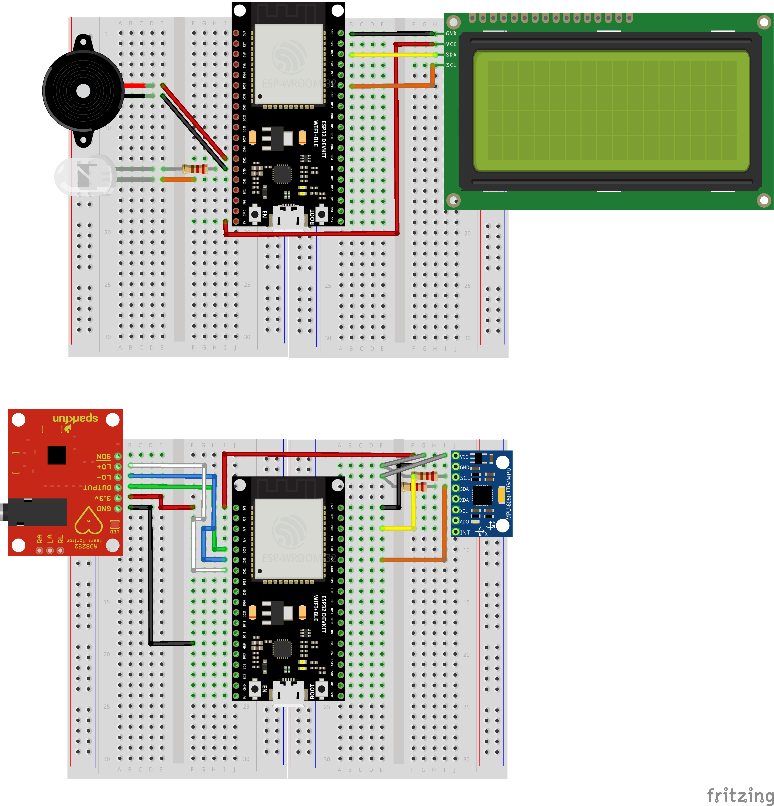

# KELOMPOK B-1 IoT

## 👥 Anggota Kelompok B-1
| No | Nama Lengkap | NIM |
|----|--------------|-----|
| 1  | Muhammad Guntur Adyatma | 2309106023 |
| 2  | Ridho Setiawan | 2409106029 |
| 3  | Triya Khairun Nisa | 2409106038 |

# Judul: Sistem Monitoring Aktivitas dan Deteksi Jatuh Lansia Berbasis AIoT 

## 📖 Deskripsi Proyek
Proyek ini mengembangkan sistem **AIoT (Artificial Intelligence of Things)** terdistribusi untuk memantau keselamatan lansia. Sistem dirancang untuk mendeteksi kejadian jatuh (*fall detection*) dan memantau kondisi biometrik menggunakan pendekatan **TinyML** yang berjalan di perangkat *edge* (ESP32). 
Dengan menggabungkan data kinetik dari akselerometer dan data detak jantung, sistem mampu membedakan antara benturan biasa dengan jatuh sungguhan melalui logika *sensor fusion*. Data dikirim secara nirkabel menggunakan protokol MQTT ke stasiun pemantauan.

## 🏗️ Arsitektur Sistem
Sistem memisahkan peran menjadi dua node untuk efisiensi daya dan fokus fungsi:
- **📍 Node 1: Wearable Device (Publisher)**  
  Menempel di pinggang (*Center of Mass*) untuk stabilitas data. Bertanggung jawab atas akuisisi sensor dan inferensi AI di tempat (*Edge Computing*).
- **🖥️ Node 2: Monitoring Station (Subscriber)**  
  Diletakkan di ruang pengawas/meja perawat. Bertugas menerima data, menampilkan peringatan visual/audio secara *remote*, dan memicu alarm darurat.

## 📋 Pembagian Tugas per Individu
| Nama Anggota | NIM | Tanggung Jawab Utama |
|--------------|-----|----------------------|
| Muhammad Guntur Adyatma | 2309106023 | Publisher, AI |
| Ridho Setiawan | 2409106029 | Publisher, website integration |
| Triya Khairun Nisa | 2409106038 | Subscriber, website integration |

## 🛠️ Komponen yang Digunakan
### 📦 Node 1 (Wearable / Publisher)
- Mikrokontroler: ESP32 Dev Module
- Sensor Gerak: MPU6050 (Accelerometer & Gyroscope)
- Sensor Biometrik: AD8232 (ECG / Heart Rate Monitor)
- Power: Baterai Li-ion
- breadboard dan kabel jumper

### 📦 Node 2 (Monitoring Station / Subscriber)
- Mikrokontroler: ESP32 Dev Module
- Display: I2C LCD 16x2
- Output: Buzzer Aktif & LED Indikator

### ℹ️ Board Schematic

